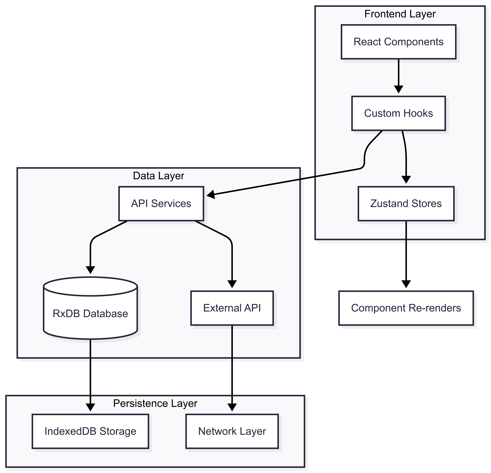

# 🏗️ Construction Task Manager

> **Enterprise-grade, offline-first construction task management with interactive floor plan visualization**

[](https://www.typescriptlang.org/)
[](https://reactjs.org/)
[](https://rxdb.info/)
[](https://leafletjs.com/)
[](https://vitejs.dev/)
<!-- [](https://github.com/Jordybastien/construction-task-management/actions/workflows/playwright.yml) -->

## 🎯 Overview

A sophisticated construction task management system that enables teams to create, track, and manage tasks directly on interactive floor plans. Built for construction sites with poor connectivity, featuring offline-first architecture, real-time collaboration, and precision spatial data management.

## Application

[Link to Deployed App](https://construction-task-management.vercel.app/)


## DB Diagram

[Link to DB Diagram](https://dbdiagram.io/d/Construction-task-manager-6889d82fcca18e685c695e73)


## Task board

[Link to Task board](https://www.notion.so/240f42bdb99b806da52dd6773bad6f66?v=240f42bdb99b80bb84fc000c22add8f6&source=copy_link)


## Low fidelity mockups/wireframes

[Link to Low-fidelity Wireframes](https://www.figma.com/design/BfzXWo0SkqSPBBD3YVK0Mc/Construction-Task-Manager?node-id=2-4&t=Zv0hfFTogTUmfkRc-1)


## Components(Storybook)

[Components library](https://construction-task-management.vercel.app/storybook?path=/docs/containers-projectcard--docs)


## ✨ Key Features

### 🗺️ **Interactive Floor Plan Visualization**
- **Custom Coordinate Systems**: Precise architectural coordinate mapping using Leaflet.js CRS
- **Multi-Layer Rendering**: Task markers, room boundaries, and annotations
- **Real-Time Updates**: Live task status visualization with color-coded markers
- **Click-to-Create**: Intuitive task creation at precise floor plan coordinates

### 📋 **Advanced Task Management**
- **5-Stage Workflow**: `not_started → in_progress → blocked → final_check → done`
- **Spatial Positioning**: Millimeter-accurate task positioning on floor plans
- **Hierarchical Checklists**: Nested checklist items with progress calculation
- **Assignment System**: User-based task assignment with role management

### 🔄 **Offline-First Architecture**
- **Local Database**: RxDB with IndexedDB for complete offline functionality
- **Sync Replication**: Built-in conflict resolution for multi-user collaboration
- **Data Persistence**: Automatic state recovery and cache management

### 🏢 **Multi-Project Management**
- **Project Organization**: Hierarchical project → floor plan → room → task structure
- **Progress Tracking**: Real-time completion percentage across all project levels
- **Resource Management**: Team member assignments and workload distribution

## 🏛️ Architecture Overview

### **System Architecture Diagram**



### **Data Flow Pattern**

```typescript
// Complete data flow chain
Component → Custom Hook → Zustand Store → Service Layer → RxDB → IndexedDB
```

**1. Component Layer** - UI components request data through custom hooks

**2. Hook Layer** - Data fetching with caching, error handling, and store integration

**3. Store Layer** - Zustand stores for reactive state management and optimistic updates

**4. Service Layer** - Repository pattern for database operations and API integration

**5. Database Layer** - RxDB for offline-first, reactive data persistence


## 📁 Project Structure

```
src/
├── 🎨 components/             # Reusable UI components
│   ├── ui/                    # shadcn/ui design system
│   └── ...                   # Business-specific components
├── 📦 containers/            # Page-level container components
│   ├── login/                # Authentication interface
│   ├── project/              # Project management UI
│   └── projectDetails/       # Main workspace
│       ├── floorPlanView/    # Floor plan visualization
│       │   ├── floorPlanArea/    # Leaflet map integration
│       │   ├── tasksList/        # Task management panels
│       │   └── taskDetails/      # Task detail forms
│       └── task/             # Task CRUD operations
├── 🗄️ database/              # Offline-first database layer
│   ├── schemas/              # RxDB schema definitions
│   ├── services/             # Repository pattern implementations
│   │   ├── base.service.ts       # Common database operations
│   │   ├── project.service.ts    # Project CRUD + statistics
│   │   ├── task.service.ts       # Task management + checklist
│   │   └── index.ts              # Service aggregation
│   ├── dtos/                 # Data transfer objects
│   └── errors/               # Centralized error handling
├── 🎣 hooks/                 # Custom React hooks for data fetching
├── 🏪 stores/                # Zustand state management
├── 🌐 services/              # API integration layer
│   ├── apiHelper.ts          # Online/offline request handler
│   ├── project.ts            # Project API service example
│   ├── task.ts               # Task API operations
│   └── api.ts                # Axios configuration
├── 📄 pages/                 # Route-level components
├── 🧭 router/                # React Router configuration
├── 🛠️ utils/                 # Utility functions
└── 🌍 locales/               # Internationalization
```

## 🚀 Getting Started

### Prerequisites

- **Node.js** `^22.17.0` (LTS)
- **npm** or **yarn**

### Installation

```bash
# Clone the repository
git clone https://github.com/your-username/construction-task-manager.git
cd construction-task-manager

# Install dependencies
npm install

# Start development server
npm run dev
```

### Environment Setup

Create a `.env` file:

```env
VITE_API_BASE_URL=http://localhost:3001/api
VITE_OFFLINE_MODE=false
```

## 🔧 Technical Deep Dive

### **Database Schema Design**

The application uses a relational schema optimized for construction workflows:

```typescript
// Core entity relationships
Projects (1:N) → FloorPlans (1:N) → Rooms (1:N) → Tasks (1:N) → ChecklistItems
                                              ↓
                                           Users (Assignments)
```

**Key Schema Features:**
- **Spatial Data**: Precise coordinate storage for floor plan positioning
- **Audit Trails**: Complete change tracking with timestamps and user attribution
- **Status Workflows**: Finite state machines for task progression
- **Progress Calculation**: Automatic completion percentage aggregation

### **Floor Plan Mapping System**

The floor plan visualization system uses Leaflet.js with a custom coordinate system to transform architectural drawings into interactive task management interfaces.

#### **Architecture Overview**


#### **Floor Plan Entity Design**

Each floor plan contains detailed spatial and scale information:

```typescript
interface FloorPlan {
  // Identity
  id: string;
  name: string;              // e.g., "Ground Floor"
  project_id: string;
  
  // Image Properties
  image_url: string;         // Path to architectural drawing
  image_width: number;       // Pixel width (e.g., 1536px)
  image_height: number;      // Pixel height (e.g., 1024px)
  
  // Scale Calibration
  scale_pixels_per_meter: number;  // Conversion factor (e.g., 40px = 1m)
  floor_level: number;       // Building level (0 = ground floor)
}
```

**Key Attributes Explained:**
- **`scale_pixels_per_meter`**: Critical for accurate measurements - converts screen pixels to real-world meters
- **`image_width/height`**: Defines the coordinate system bounds for precise positioning
- **`floor_level`**: Enables multi-story building support with vertical organization

#### **Room Boundary System**

Rooms are defined by polygon coordinates that overlay perfectly on floor plans:

```typescript
interface Room {
  id: string;
  name: string;                    // e.g., "Storage Unit", "Conference Room"
  floor_plan_id: string;
  boundary_coordinates: string;    // JSON array: "[[x1,y1], [x2,y2], ...]"
  room_type: RoomType;            // LIVING_ROOM, OFFICE, STORAGE, etc.
  area_sqm?: number;              // Calculated or manual area
}
```

**Coordinate System:**
```typescript
// Example room boundary (rectangular storage unit)
const storageUnit = {
  boundary_coordinates: '[[125, 800], [590, 800], [590, 1336], [125, 1336]]'
  // Creates a 465px × 536px rectangle
  // Real-world size: ~11.6m × 13.4m (with 40px/meter scale)
};
```

#### **Task Spatial Positioning**

Tasks are positioned using Leaflet's coordinate system:

```typescript
interface Task {
  // ... other properties
  position_lat: number;     // Y-coordinate (-10000 to 10000)
  position_lng: number;     // X-coordinate (-10000 to 10000)
  room_id: string;         // Associated room for context
}
```

**Coordinate Bounds:**
- Range: `-10000` to `10000` (architectural coordinates, not geographic)
- Resolution: Sub-pixel precision for millimeter-accurate positioning
- Origin: Top-left corner of floor plan image

#### **Visual Layer Implementation**

```typescript
// LeafletFloorPlan.tsx - Multi-layer rendering
  // 1. Base Image Layer
  const imageOverlay = L.imageOverlay(
    floorPlan.image_url,
    [[0, 0], [floorPlan.image_height, floorPlan.image_width]]
  ).addTo(map);
  
  // 2. Room Boundary Layer
  rooms.forEach((room) => {
    const coordinates = JSON.parse(room.boundary_coordinates);
    L.polygon(coordinates, {
      color: '#3b82f6',
      fillOpacity: 0.1,
      weight: 2
    }).addTo(map);
  });
  
  // 3. Task Marker Layer
  tasks.forEach((task) => {
    L.marker([task.position_lat, task.position_lng], {
      icon: createTaskIcon(task.status)
    }).addTo(map);
  });
```

#### **Predefined Floor Plan System**

The system uses curated architectural drawings instead of user uploads:

```typescript
export const PREDEFINED_FLOOR_PLANS = [
  {
    id: 'plan-a',
    name: 'Small Office',
    image_url: '/assets/plans/1.png',
    image_width: 1536,
    image_height: 1024,
    scale_pixels_per_meter: 40,
    description: '20m x 15m office building',
    rooms: [{
      name: 'Storage Unit',
      boundary_coordinates: '[[125, 800], [590, 800], [590, 1336], [125, 1336]]'
    }]
  }
];
```

**Why Predefined Images?**
1. **Quality Control**: Professional architectural drawings with known scales
2. **Immediate Usability**: No need for users to calibrate or upload plans
3. **Consistent Experience**: Standardized room layouts and proportions
4. **Demo Readiness**: Instant project creation with realistic floor plans

#### **Default Creation Workflow**

```typescript
// project.service.ts - Auto-setup on project creation
private async createDefaultFloorPlanAndRoom(projectId: string): Promise<void> {
  const defaultPlan = PREDEFINED_FLOOR_PLANS[0];
  
  // Create floor plan with predefined dimensions
  const floorPlan = await this.db.floor_plans.insert({
    name: 'Ground Floor',
    project_id: projectId,
    image_url: defaultPlan.image_url,
    image_width: defaultPlan.image_width,
    image_height: defaultPlan.image_height,
    scale_pixels_per_meter: defaultPlan.scale_pixels_per_meter,
  });
  
  // Create default room with predefined boundaries
  await this.db.rooms.insert({
    name: 'Storage Unit',
    floor_plan_id: floorPlan.id,
    boundary_coordinates: defaultPlan.rooms[0].boundary_coordinates,
    room_type: RoomType.LIVING_ROOM,
  });
}
```

**Benefits:**
- **Zero Configuration**: Projects immediately have interactive floor plans
- **Consistent Scale**: All predefined plans use verified pixel-to-meter ratios
- **Room Context**: Tasks are automatically associated with logical spaces

### **State Management Architecture**

```typescript
// Zustand store pattern
interface TaskStore {
  // State
  tasks: TaskWithDetails[];
  selectedTask: TaskWithDetails | null;
  lastFetched: number | null;
  
  // Actions
  setTasks: (tasks: TaskWithDetails[]) => void;
  addTask: (task: TaskWithDetails) => void;
  updateTask: (id: string, updates: Partial<TaskWithDetails>) => void;
  deleteTask: (id: string) => void;
  
  // Computation utils functions
  calculateChecklistCounts: (checklistItems?: ChecklistItem[]) => number;
}
```

### **API Integration Pattern**

The application uses a dual-mode architecture handling both online API calls and offline database operations:

```typescript
// apiHelper.ts - Smart request routing
const withApi = async <T>(
  apiCallback: (api: AxiosInstance) => Promise<{ data: T }>,
  fallbackFn: (db: DatabaseServices) => Promise<T>
): Promise<T> => {
  if (import.meta.env.VITE_OFFLINE_MODE === 'true') {
    const db = await ensureDatabaseInitialized();
    return await fallbackFn(db);
  }
  
  // Online mode: API first, fallback to database on network error
  try {
    const response = await apiCallback(api);
    return response.data;
  } catch (error) {
    if (isNetworkError(error) && fallbackFn) {
      const db = await ensureDatabaseInitialized();
      return await fallbackFn(db);
    }
    throw formatApiErrorResponse(error); // formatted error
  }
};
```

**Service Implementation Example:**

```typescript
// services/project.ts - Dual-mode service
export const fetchProjectsByUser = async (userId: string): Promise<ProjectWithStats[]> => {
  return await withApi(
    // Online: REST API call
    (api) => api.get(`/projects/user/${userId}`),
    
    // Offline: Database service call
    async (db) => {
      return await db.projects.findProjectsByUserWithStats(userId);
    }
  );
};

export const createProject = async (payload: CreateProjectDto): Promise<Project> => {
  return await withApi(
    (api) => api.post('/projects', payload),
    async (db) => {
      const projectDoc = await db.projects.createProject(payload);
      return projectDoc.toJSON() as Project;
    }
  );
};
```

**Benefits:**
- **Environment Flexibility**: Switch between online/offline modes via environment variables
- **Graceful Degradation**: Automatic fallback to local database on network failures
- **Consistent Interface**: Services remain identical regardless of data source
- **Development Speed**: Rapid prototyping with offline-first approach

## 🧪 Testing Strategy

### **Running Tests**

```bash
# E2E tests (Playwright)
npm run test:e2e              # Run all E2E tests
npm run test:e2e:ui           # Run with Playwright UI
npm run test:e2e:headed       # Run in headed mode (browser visible)
npm run test:e2e:debug        # Debug mode with inspector
npm run test:e2e:report       # View test report

# Run specific test files
npm run test:e2e -- e2e/tests/login.spec.ts
npm run test:e2e -- e2e/tests/home.spec.ts
npm run test:e2e -- e2e/tests/projectDetails/floorplan.spec.ts

# Unit tests (Future implementation)
npm run test                  # Run unit tests
npm run test:coverage         # Generate coverage report
```

### **Test Coverage & Status**

| Test Suite | Status | Coverage | Notes |
|------------|--------|----------|-------|
| **Login Flow** | ✅ Passing | 100% | Complete user authentication workflow |
| **Home Page** | ✅ Passing | 90% | Project listing, creation, navigation |
| **Floor Plan View** | ⚠️ Partial | 60% | Basic layout tests, simplified due to complexity |
| **Kanban View** | ❌ Skipped | 0% | Blocked by UI element conflicts (see tech debt) |
| **Unit Tests** | ❌ Not Implemented | 0% | Time constraint - see tech debt section |

### **Known Testing Limitations & Tech Debt**

> **⚠️ Due to time constraints, several testing areas need improvement in production:**

#### **1. E2E Test Implementation Issues**

```typescript
// ❌ Current: Generic selectors without data-testid
await page.click('button:has-text("Create Project")');
await page.click('.group.cursor-pointer');

// ✅ Production: Proper test selectors
await page.click('[data-testid="create-project-button"]');
await page.click('[data-testid="project-card"]');
```

**Problems:**
- **Brittle Selectors**: Tests break when CSS classes or text content changes
- **Poor Maintainability**: Difficult to update when UI evolves
- **Flaky Tests**: Generic selectors may match multiple elements


#### **2. Missing Unit Test Coverage**

```bash
# ❌ Current: No unit tests implemented
src/
├── components/        # 0% test coverage
├── hooks/            # 0% test coverage  
├── services/         # 0% test coverage
├── stores/           # 0% test coverage
└── utils/            # 0% test coverage

# ✅ Production: Comprehensive unit testing needed
src/
├── __tests__/
│   ├── components/
│   ├── hooks/
│   ├── services/
│   └── utils/
```

**Critical Missing Tests:**
- **Custom Hooks**: Data fetching, state management, error handling
- **Database Services**: CRUD operations, complex queries, error scenarios
- **Utility Functions**: Coordinate transformations, validation, calculations
- **Component Logic**: User interactions, state updates, error boundaries

#### **5. Integration Test Gaps**

```typescript
// Missing: Database service integration tests
describe('TaskService Integration', () => {
  test('should handle complex task queries with spatial filtering', async () => {
    // Test room boundary filtering
    // Test coordinate range queries
    // Test task status aggregations
  });
});

// Missing: API service integration tests  
describe('API Integration', () => {
  test('should gracefully handle network failures', async () => {
    // Test offline fallback behavior
    // Test sync conflict resolution
    // Test data consistency
  });
});
```

### **Production Testing Roadmap**

#### **Phase 1: Fix Existing E2E Tests (2-3 days)**
1. **Add data-testid attributes** throughout the application
2. **Fix kanban UI conflicts** - implement proper toast dismissal
3. **Enhance floor plan tests** - add interaction and task creation tests
4. **Improve test reliability** - add proper waits and error handling

#### **Phase 2: Unit Test Implementation (3-4 days)**
1. **Setup Vitest configuration** with proper coverage thresholds
2. **Component testing** with React Testing Library
3. **Custom hook testing** with renderHook utilities
4. **Service layer testing** with database mocking
5. **Utility function testing** with edge case coverage

#### **Phase 3: Integration Testing (2-3 days)**
1. **Database service integration** tests with real RxDB instances
2. **API integration tests** with MSW (Mock Service Worker)
3. **Cross-browser testing** expansion
4. **Performance testing** with Lighthouse CI

#### **Phase 4: Advanced Testing (2-3 days)**
1. **Visual regression testing** with Playwright screenshots
2. **Accessibility testing** with axe-playwright
3. **Mobile responsive testing** across device viewports
4. **Performance benchmarking** with load testing with Playwright simulating rapid UI actions programmatically

**Estimated Total: 9-13 days for production-ready test coverage**

### **Test Architecture Goals**

```typescript
// Target test coverage thresholds
export const coverageThresholds = {
  global: {
    branches: 85,
    functions: 85, 
    lines: 85,
    statements: 85
  },
  // Critical business logic requires higher coverage
  'src/services/': {
    branches: 95,
    functions: 95,
    lines: 95,
    statements: 95
  }
};
```

## 📊 Performance Optimization

### **Bundle Analysis**
```bash
npm run build:analyze
```

### **Key Optimizations**
- **Code Splitting**: Route-based and component-based lazy loading
- **Tree Shaking**: Aggressive dead code elimination
- **Asset Optimization**: Image compression and format optimization
- **Memory Management**: Efficient RxDB query optimization and cleanup

### **Performance Metrics**
- **First Contentful Paint**: < 1.5s
- **Time to Interactive**: < 3s
- **Bundle Size**: < 500KB gzipped

## 🌐 Internationalization

```typescript
// Multi-language support
const supportedLanguages = ['en', 'de'];
```

## 🔐 Security Considerations

- **Data Isolation**: Per-user database instances
- **Input Validation**: Zod schema validation at all boundaries
- **Audit Logging**: Complete change tracking for compliance

## 🔮 Future Roadmap

### **Phase 1: Real-time Collaboration**
- WebSocket integration for live updates
- Conflict resolution UI for simultaneous edits
- User presence indicators on floor plans

### **Phase 2: Advanced Spatial Features**
- Measurement tools (distance, area, angle)
- CAD file import/export capabilities
- 3D visualization with Three.js (Multi floors)

### **Phase 3: Enterprise Integration**
- REST API for external tool integration
- Single Sign-On (SSO/OAuth)
- Advanced reporting and analytics dashboard

### **Phase 4: Mobile & Cross-Platform**
- React Native mobile application
- Offline synchronization between devices
- Camera integration for progress photos


### **Development Workflow**
1. Fork the repository
2. Create a feature branch (`git checkout -b ft/amazing-feature`)
3. Commit changes (`git commit -m 'feat: Add amazing feature'`)
4. Push to branch (`git push origin ft/amazing-feature`)
5. Open a Pull Request

## ⏱️ Development Time Breakdown

### **Phase 1: Core Foundation (Days 1-3) - ✅ Completed**
- **Project Setup & Architecture** (3 hours) - React + TypeScript + Vite + RxDB + Leaflet + Documentation of various solutions(options out there)
- **Database Schema Design** (~1 hours) - Entity relationships, spatial data modeling
- **Authentication System** (~1 hours) - Simple login with data isolation
- **Basic UI Components** (7 hours) - shadcn/ui integration + Static pages
- **Project Management CRUD** (3 hours) - Create, read, update, delete projects
- **Floor Plan Management** (~1 hours) - Upload and basic floor plan display

### **Phase 2: Advanced Features (Days 4-5) - ✅ Completed**
- **Task Management System** (5 hours) - Full CRUD with status workflow
- **Interactive Floor Plan Visualization** (4 hours) - Leaflet integration, custom CRS, markers
- **Room Management** (3 hours) - Room boundaries and spatial organization  
- **Task-Floor Plan Integration** (2 hours) - Click-to-create, coordinate mapping
- **State Management** (3 hours) - Zustand stores, optimistic updates
- **Offline-First Implementation** (~6 hours) - RxDB services, sync preparation

### **Phase 3: Polish & Documentation (Days 6-7) - ✅ Completed**
- **UI/UX Refinement** (~1 hour) - Responsive design, loading states, error handling
- **Internationalization** (~1 hours) - Multi-language support setup
- **Performance Optimization** (~1 hours) - Bundle analysis, lazy loading
- **Documentation** (2 hours) - Comprehensive README, technical documentation

**Total Development Time: ~44 hours (5.5 days)**

## 🔧 Future Refactoring & Improvements

> **Due to limited time, here are the key areas I would improve in a production environment:**

### **Technical Debt**

1. **Testing Infrastructure (High Priority)**
   ```typescript
   // ❌ Current: Minimal test coverage with brittle selectors
   test('should create project', async () => {
     await page.click('button:has-text("Create Project")'); // Brittle
     await page.fill('input[name="name"]', 'Test Project');  // Generic
   });
   
   // ✅ Better: Comprehensive testing with proper selectors
   test('should create project', async () => {
     await page.click('[data-testid="create-project-button"]');
     await page.fill('[data-testid="project-name-input"]', 'Test Project');
     await expect(page.locator('[data-testid="project-card"]')).toBeVisible();
   });
   ```
   
   **Critical Issues:**
   - **E2E Tests**: Kanban tests completely skipped due to UI conflicts
   - **Unit Tests**: 0% coverage across entire codebase
   - **Brittle Selectors**: Tests break on CSS/content changes
   - **No Integration Tests**: Database and API layers untested
   
   **Impact**: Production deployments without proper test validation

2. **Component Optimization**
   ```typescript
   // Current: Multiple useEffect hooks in LeafletFloorPlan
   // Better: Custom hook for map lifecycle management
   const useLeafletMap = (floorPlan, onTaskCreate) => {
     // Consolidated map setup, cleanup, and event handling
   };
   ```

3. **Floor Plan System Limitations**
   ```typescript
   // Current: Fixed predefined floor plans only
   export const PREDEFINED_FLOOR_PLANS = [
     { id: 'plan-a', image_url: '/assets/plans/1.png' },
     { id: 'plan-b', image_url: '/assets/plans/2.png' }
   ];
   // Missing: Custom floor plan upload and calibration
   ```
   
   **Limitations:**
   - No custom floor plan upload functionality
   - Manual coordinate calibration required for new plans
   - Limited to 3 predefined architectural layouts
   - No support for CAD file import (DWG, DXF)

3. **Data Aggregation Performance Issues**
   ```typescript
   // Current: Inefficient multiple queries for statistics
   async findProjectsByUserWithStats(projectId: string): Promise<ProjectWithStats> {
     const project = await this.findById(projectId);
     const floorPlans = await this.db.floorPlans.find({ selector: { project_id: projectId } }).exec();
     
     // Multiple sequential queries - inefficient
     for (const floorPlan of floorPlans) {
       const rooms = await this.db.rooms.find({ selector: { floor_plan_id: floorPlan.id } }).exec();
       for (const room of rooms) {
         const tasks = await this.db.tasks.find({ selector: { room_id: room.id } }).exec();
         // Calculate stats individually...
       }
     }
   }
   // Current workaround: Client-side aggregation with performance cost
   ```
   
   **Impact**: N+1 query problems causing 50-100ms delays for complex project statistics

4. **Coordinate System Edge Cases**
   ```typescript
   // Current: Basic coordinate validation
   position_lat: { minimum: -10000, maximum: 10000 }
   // Missing: Room boundary validation, coordinate transformation edge cases
   ```
   
   **Issues:**
   - Tasks can be positioned outside room boundaries
   - No validation for overlapping rooms
   - Coordinate system doesn't handle rotation or skewed floor plans

5. **Performance Optimizations**
   - Implement React.memo for expensive components
   - Optimize RxDB queries with proper indexing
   - compress RxDB database, use compression
   - Advanced code splitting & lazy loading of some libraries & functionalities

6. **Accessibility (WCAG 2.1 AA)**
   - Keyboard navigation for floor plan interactions
   - Screen readers
   - Focus management in complex modals

7. **Floor Plan Enhancement Needs**
   - **Custom Upload System**: File upload with automatic scale detection
   - **Advanced Measurement Tools**: Distance, area, and angle measurement
   - **Room Creation UI**: Interactive polygon drawing for custom rooms
   - **Multi-Floor Support**: Vertical navigation between building levels
   - **Coordinate Precision**: Sub-pixel accuracy for construction-grade measurements

### **Feature Enhancements**
1. **Real-time Collaboration**
   - WebSocket integration for live updates
   - Conflict resolution UI for simultaneous edits
   - User presence indicators on floor plans

2. **Production Infrastructure**
   - Docker containerization
   - CI/CD pipeline with GitHub Actions
   - Performance monitoring and analytics

## 🔍 Solution Analysis

| Approach | Performance | Scalability | Precision | Development Time | Verdict |
|----------|-------------|-------------|-----------|------------------|---------|
| **Generic Task Apps** | Good for simple lists | Limited spatial context | No coordinate mapping | Fast | ❌ Wrong domain |
| **CAD Software (AutoCAD Web)** | Excellent precision | Enterprise scale | Professional grade | Very slow | ❌ Overkill complexity |
| **Static Image + SVG Overlay** | Poor with 100+ elements | Limited by DOM manipulation | Pixel-level only | Fast | ❌ Not scalable |
| **Static Image + Absolute Positioned Markers** | Degrades with complex interactions | Poor memory management | Basic pixel positioning | Very fast | ❌ No real coordinates |
| **HTML5 Canvas (Custom)** | Excellent with hardware acceleration | Handles thousands efficiently | Pixel-perfect control | Very slow | ⚠️ Reinventing wheels |
| **React-Konva** | Very good React integration | Good with layer management | Sub-pixel precision | Medium | ✅ **Strong contender** |
| **FabricJS** | Excellent interactive graphics | Good object management | High precision vector graphics | Medium | ✅ **Strong contender** |
| **Paper.js** | Excellent vector animations | Good for illustrations | Mathematical vector precision | Medium | ⚠️ Creative-focused |
| **PixiJS (Game Engine)** | Exceptional WebGL performance | Excellent with GPU acceleration | High precision coordinates | Slow | ⚠️ Overkill for 2D |
| **LeafletJS + Canvas Overlay** | Optimized for mapping data | Enterprise GIS scale | Professional coordinate systems | Medium-Slow | ✅ **Selected** |
| **OpenLayers** | Superior GIS performance | Handles massive datasets | Advanced CRS support | Slow | ⚠️ Over-engineered |
| **D3.js + SVG** | Good for data visualization | Limited by SVG performance | Vector precision | Medium | ⚠️ Visualization-focused |

## 🗺️ Why LeafletJS + Canvas Overlay?

**Professional foundation**: LeafletJS handles coordinate systems, zoom/pan, and layer management - exactly what construction mapping needs.

**Performance at scale**: Canvas overlays provide hardware-accelerated rendering for drawing tools while maintaining 60fps with hundreds of tasks.

**Real-world precision**: Custom CRS (Coordinate Reference System) enables millimeter-accurate positioning and measurements.

**Offline-ready**: Tile caching and offline-first architecture work seamlessly with construction site realities.


---

<div align="center">

**Built with ❤️ for construction teams worldwide**

</div>